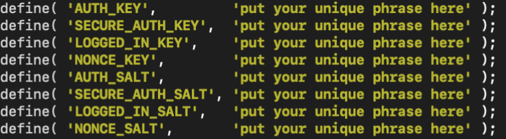
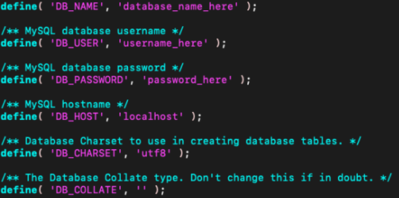
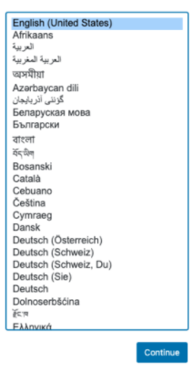
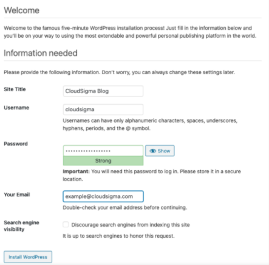
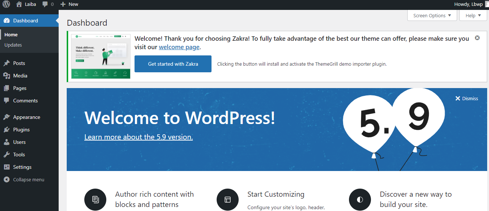
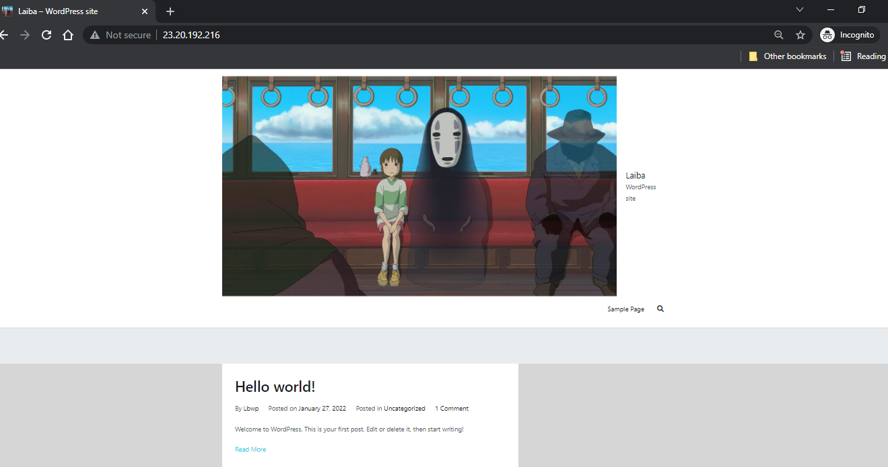

# Wordpress-with-LAMP
<h2>EC2 Instance</h2>

Use main.tf to set up ec2 instance

<h2>LAMP STACK</h2>

Follow this reference to
<a href="https://github.com/LaibaBasit008/Webserver-configuration-using-Terraform">Setup Lamp</a> to the point of installing phpmyadmin

<h2>WordPress Setup</h2>

Follow these commands to setup WordPress

<ul>
<li>sudo mysql -u root
</li>

update the root user’s password

<li>ALTER USER 'root'@'localhost' IDENTIFIED WITH mysql_native_password BY 'new_password';
</li>

Type Exit

<li>mysql -u root -p
</li>
<li>CREATE DATABASE wordpress DEFAULT CHARACTER SET utf8 COLLATE utf8_unicode_ci;
</li>
<li>CREATE USER 'wordpressuser'@'%' IDENTIFIED WITH mysql_native_password BY 'set_your_own_password';
</li>
<li>GRANT ALL ON wordpress.* TO 'wordpressuser'@'%';
</li>
<li>FLUSH PRIVILEGES;
</li>
<li>EXIT;
</li>
<li>sudo apt update
</li><li>sudo apt install php-curl php-gd php-mbstring php-xml php-xmlrpc php-soap php-intl php-zip
</li>

<li>sudo systemctl restart apache2
</li>

<li>sudo nano /etc/apache2/sites-available/wordpress.conf
</li>

 allow .htaccess files using:

<li><Directory /var/www/wordpress/>
    AllowOverride All
</Directory></li>

Press Ctrl+X to exit along with y

<li>sudo a2enmod rewrite
</li>

<li>sudo apache2ctl configtest
</li>
<li>sudo systemctl restart apache2
</li>
<li>cd /tmp</li><li>
curl -O https://wordpress.org/latest.tar.gz
</li>
<li>tar xzvf latest.tar.gz
</li>
<li>touch /tmp/wordpress/.htaccess
</li>
<li>cp /tmp/wordpress/wp-config-sample.php /tmp/wordpress/wp-config.php
</li>
<li>mkdir /tmp/wordpress/wp-content/upgrade
</li>
<li>sudo cp -a /tmp/wordpress/. /var/www/wordpress
</li>
<li>sudo chown -R www-data:www-data /var/www/wordpress
</li>
<li>sudo find /var/www/wordpress/ -type d -exec chmod 750 {} \;</li><li>
sudo find /var/www/wordpress/ -type f -exec chmod 640 {} \;
</li>
<li>curl -s https://api.wordpress.org/secret-key/1.1/salt/
</li>

Copy these values and run following command

<li>sudo nano /var/www/wordpress/wp-config.php
</li>

Remove these and paste copied values here

Put database name at DB_NAME and user at DB_USER set while creating wordpress database. Replace DB_collate with define('FS_METHOD', 'direct');

Refresh Public IP and Install WP

</ul>

<h2>Install WP</h2>

Set Language

Set username, email and password

Login using above username and password. Edit Site using dashboard

Refresh url now it will contain your WP Site

